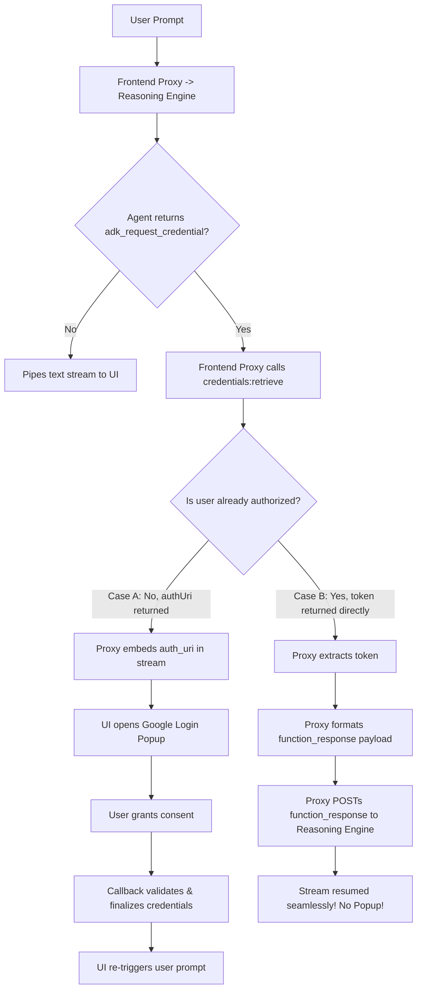

# ADK 3-Legged OAuth & Auth Manager Playbook

This operational playbook serves as a specialized AI Skill for downstream coding agents and developers building decoupled frontends or middle-tier API proxies that interact with custom **Agent Development Kit (ADK)** agents requiring **3-Legged OAuth (3LO)** via the **GCP Agent Identity Auth Manager**.

---

## When to Use This Skill

### Positive Triggers
- Configuring 3-legged OAuth (3LO) for ADK agents.
- Integrating GCP Agent Identity auth manager (`agentidentitycredentials.googleapis.com` / V2 API).
- Intercepting `adk_request_credential` function calls in middle-tier API proxies.
- Managing stateless consent nonces and OAuth callback finalization (`credentials:retrieve` / `credentials:finalize`).

### Negative Triggers (When NOT to Use)
- Standard REST SSE stream parsing, UI component rendering, or basic FastAPI proxy endpoint response models without OAuth interception -> Delegate to **`google-agents-cli-adk-frontend`**.

## 📅 Effective Date & Version Warning
> [!IMPORTANT]
> **Validation Date:** July 16, 2026
> This playbook leverages **Alpha/Beta** features of GCP Agent Identity and the ADK. Since these services are actively evolving, keep a close watch on API endpoints and schemas.

---

## 🌐 API Evolution & Consolidation
When developing against the Auth Manager, you will encounter two sets of APIs. **Always prioritize the newer V2 API format:**

1. **Modern V2 API (Recommended):**
   * **Domain:** `agentidentitycredentials.googleapis.com`
   * **Resource Terminology:** `authProviders`
   * **Format:** `projects/{project}/locations/{location}/authProviders/{provider}`
2. **Legacy V1 API (Fallback / Deployed Environment Caveat):**
   * **Domain:** `iamconnectorcredentials.googleapis.com`
   * **Resource Terminology:** `connectors`
   * **Format:** `projects/{project}/locations/{location}/connectors/{connector}`

> [!WARNING]
> While older cloud environments might still expect retrieve payloads on the legacy `/connectors/` paths, all new integrations should aim for the unified `/authProviders/` namespaces.

---

## 🔄 The 3LO Handshake Architecture

When an ADK Agent needs user consent to execute an MCP tool, it emits a special function call: `adk_request_credential`. A custom UI application or its middle-tier proxy must intercept this call and process it through one of two branches:

---

## 🛠️ Step-by-Step Skill Implementations

To implement this flow perfectly, read the detailed reference materials and use our proven code samples:

1. **GCP Console & Auth Provider Setup**
   * [OAuth Client Setup and Provider Config](references/oauth_client_setup.md)
2. **Interception (Standard FastAPI Middleware Proxy)**
   * Read [Stateless Consent Nonce Management](references/stateless_consent_nonce.md) to understand why cookies/sessions are required on Cloud Run.
   * Review [examples/proxy_interceptor.py](examples/proxy_interceptor.py) to implement `/api/chat` interception.
3. **Resumption Payload Structure**
   * Review [examples/stream_resumption.py](examples/stream_resumption.py) to see the exact payload expected by `/run_sse` to bypass popups.
4. **Active Debugging & Troubleshooting**
   * Refer to the [Troubleshooting Matrix](references/troubleshooting.md) for 403, 404, and 400 errors.
