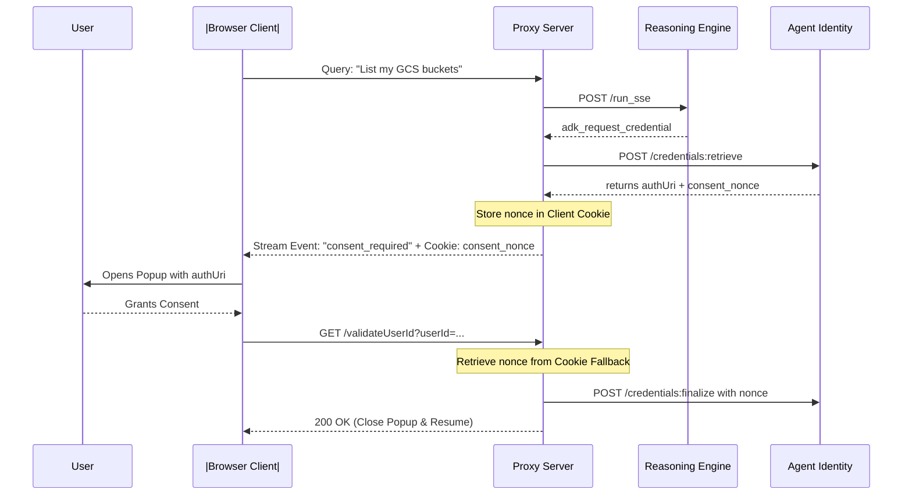

# Stateless Consent Nonce Management

When implementing the 3-Legged OAuth v2 flow inside highly scalable, stateless container environments (such as Google Cloud Run), you will face state-synchronization issues. This guide details how to resolve them.

---

## ⚠️ The Cloud Run Stateless Challenge

When a custom UI or its backend proxy intercepts the `adk_request_credential` event, it calls the GCP `credentials:retrieve` endpoint.
1. The `credentials:retrieve` API generates a **unique** `consent_nonce` along with the `authorizationUri`.
2. This `consent_nonce` **MUST** be passed to the subsequent `/credentials:finalize` endpoint once the user grants consent in the login popup.
3. If your frontend application is scaled across multiple Cloud Run instances, storing this nonce in local container memory or local variables will cause intermittent failures:
   * **Instance A** makes the retrieve request and generates the nonce.
   * The user clicks the login popup and completes authorization.
   * The OAuth redirect callback (`/validateUserId`) lands on **Instance B** due to load-balancer routing.
   * **Instance B** does not have the nonce in memory, resulting in a **`400 Bad Request`** or missing nonce error during the finalize call.

---

## 🍪 The Solution: Client-Side Cookie Syncing

To resolve this issue with 100% resilience, store the `consent_nonce` on the client's browser (such as in cookies or session storage) immediately during the stream intercept, and read it back during the redirect callback.



### Cookie Implementation Pattern (FastAPI)
During the streaming proxy `/api/chat` route, set the cookie on the client response headers:

```python
# In your streaming loop:
if "consent_nonce" in retrieve_data:
    nonce = retrieve_data["consent_nonce"]
    # Pass the nonce in the stream event so the frontend can store it
    yield f"event: consent_required\ndata: {json.dumps({'auth_uri': auth_uri, 'nonce': nonce})}\n\n"
```

And in the OAuth callback (`/validateUserId`), read the cookie:

```python
@app.get("/validateUserId")
async def validate_user_id(
    request: Request,
    userId: str,
    consent_nonce: str = None
):
    # If the redirect URI didn't carry the nonce in the query parameters,
    # pull it from the client browser cookies to bypass stateless container boundaries!
    if not consent_nonce:
        consent_nonce = request.cookies.get("consent_nonce")
        
    if not consent_nonce:
        raise HTTPException(status_code=400, detail="Missing consent nonce")

    # Proceed to post to credentials:finalize
```
