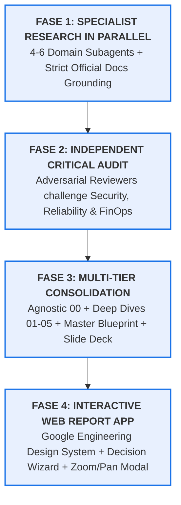

# Architecture Research & Interactive Blueprint Skill

This skill defines a deterministic, multi-agent workflow for conducting deep-dive architectural investigations, evaluating complex cloud/software trade-offs, auditing resilience and security postures, and publishing publication-grade interactive web reports.

---

## When to Use This Skill

### Positive Triggers (Use this skill when:)
- Conducting exhaustive, multi-domain architectural investigations (e.g., Multi-Tenancy on Cloud, Event-Driven Architectures, Zero-Trust Enterprise Networks, Global Database Topologies).
- Evaluating multi-dimensional trade-offs requiring parallel specialized research across different infrastructure layers (Ingress, Compute, Persistence, Security, FinOps).
- Performing adversarial architectural reviews (Security/Blast Radius, Noisy Neighbor/Contention, Operational Burden/DDL migrations).
- Generating structured multi-tier deliverables (Agnostic Foundations $\to$ Modular Domain Reports $\to$ Master Decision Matrix $\to$ Executive Presentation Blueprint $\to$ Interactive Web Report).

### Negative Triggers (Do NOT use this skill when:)
- Documenting existing code flows with quick diagrams $\to$ use [`visual-docs`](../visual-docs/) instead.
- Simple ad-hoc code explanation, bug fixing, or single-file refactoring $\to$ handle directly.
- Migrating single AWS Lambda functions $\to$ use [`aws-lambda-to-cloud-run-migration`](../aws-lambda-to-cloud-run-migration/) instead.
- Developing or testing Apigee X proxies $\to$ use [`apigee-x-proxy-development`](../apigee-x-proxy-development/) instead.

---

## The 4-Phase Architecture Lifecycle

---

## Phase 1: Parallel Specialist Subagents (`invoke_subagent`)

1. **Decompose into Orthogonal Macro-Domains:**
   Break down the problem space into 4 to 6 mutually exclusive domains. For instance, in Cloud Multi-Tenancy:
   - *Domain 1:* Resource Hierarchy, Governance, IAM, VPC-SC & Network Isolation.
   - *Domain 2:* Edge Routing, Anycast LB, Cloud DNS, WAF & API Management.
   - *Domain 3:* Compute & Container Orchestration (GKE Fleets, Sandboxing, Serverless).
   - *Domain 4:* Stateful Persistence, Databases (SQL, NoSQL, Spanner) & Storage.
   - *Domain 5:* FinOps, Cost Allocation, Tenant Observability & Noisy Neighbor Mitigation.

2. **Spawn Specialist Subagents Concurrently:**
   - Equip each subagent with research MCPs (e.g. `google-developer-knowledge`, `search_web`).
   - **Strict Grounding Invariant:** Every architectural assertion, quota limit, and recommendation must cite verified official documentation links (`https://cloud.google.com/...`).
   - Require each specialist to output a standalone markdown document with trade-off matrices, concrete configuration schemas, and clean Mermaid diagrams.

---

## Phase 2: Independent Adversarial Review (`invoke_subagent`)

Never consolidate unverified research. Spawn dedicated review subagents to audit the specialist findings against the **3 Architectural Review Pillars** (see [`references/review-pillars.md`](./references/review-pillars.md)):

1. **Security, Isolation & Blast Radius Reviewer:**
   - Evaluates tenant cross-talk risks, token impersonation vulnerabilities, VPC perimeter leakage, and compliance constraints (LGPD, HIPAA, PCI-DSS).
2. **Reliability, Contention & Noisy Neighbor Reviewer:**
   - Audits resource starvations, database connection pool exhaustion, API quota throttling, and cascade failure patterns under heavy concurrent load.
3. **FinOps & Operational Burden Reviewer:**
   - Analyzes idle capacity overhead (*Idle Capacity Tax*), schema migration scaling complexity ($O(N)$ vs $O(1)$), and automated onboarding efficiency.

Each reviewer writes a formal critique to `reviews/`, providing defensive architectural countermeasures.

---

## Phase 3: Multi-Tier Consolidation

Synthesize all findings into structured, multi-tier artifacts:
- **`00_foundations_agnostic.md`:** Core mental models, taxonomy (Silo, Pooled, Bridge, Tiered), and invariants independent of any specific cloud provider.
- **`01_...md` to `05_...md`:** In-depth technical domain reports incorporating reviewer remediations.
- **`master_architecture.md`:** Executive synthesis with a multidimensional decision matrix and clear selection heuristics.
- **`presentation_slides_blueprint.md`:** Structured slide-by-slide storyline for C-level and technical leadership presentations.

---

## Phase 4: Interactive Web Report Application (`web_report/`)

Publish the architecture as a high-grade, interactive single-page application adhering to [`references/interactive-web-report-standards.md`](./references/interactive-web-report-standards.md):

1. **Google Cloud Clean Engineering Aesthetic (`styles.css`):**
   - HSL-tailored color tokens with seamless Dark/Light theme switching (`localStorage`).
   - Sticky sidebar navigation tracked via `IntersectionObserver`.
2. **Interactive Decision Engine (`app.js`):**
   - **Architecture Selection Wizard:** Dynamic questionnaire matching compliance level and scale to the optimal model.
   - **Interactive TCO Calculator:** Dynamic pricing sliders with transparent cost allocation equations.
   - **Copy-to-Clipboard & Code Tabs.**
3. **Zero-Defect Mermaid & Fullscreen Zoom & Pan Modal:**
   - Individual async `mermaid.render()` with `try/catch` isolation per diagram.
   - Built-in **Lightbox Modal** with Zoom In (+), Zoom Out (-), Reset (100%), Fit-to-Screen, Mouse Drag Pan, Wheel Zoom, and Keyboard navigation (<kbd>ESC</kbd>, <kbd>+</kbd>, <kbd>-</kbd>, <kbd>0</kbd>).
   - **Automated Math Sanitization:** Run `scripts/sanitize_web_report.py` to convert all `$math$` / `$O(N)$` tokens to clean semantic HTML, backed by `autoCleanDomMath()` in `app.js`.

## Reference Guides & Examples

### Starter Kit & Templates
- [`examples/web-report-starter/styles.css`](./examples/web-report-starter/styles.css) — Ready-to-use Google Cloud Clean Engineering stylesheet (Dark/Light theme, tokens, responsive layout, cards, badges, and zoom lightbox).
- [`examples/web-report-starter/app.js`](./examples/web-report-starter/app.js) — Battle-tested JS engine with DOM math sanitizer, async Mermaid 10 rendering, full Zoom & Pan modal lightbox, and navigation tracking.
- [`examples/web-report-starter/index.html`](./examples/web-report-starter/index.html) — Canonical HTML template demonstrating sticky sidebar, hero banner, diagram wrappers, and pedagogical callouts.

### Scripts & Utilities
- [`scripts/sanitize_web_report.py`](./scripts/sanitize_web_report.py) — CLI utility to scan and sanitize LaTeX math notations into clean HTML across all report files.

### Deep-Dive Standards
- [`references/interactive-web-report-standards.md`](./references/interactive-web-report-standards.md) — Mandatory frontend, Mermaid, and typography quality rules.
- [`references/review-pillars.md`](./references/review-pillars.md) — Deep-dive audit checklists for Security, Reliability, and FinOps reviewers.
