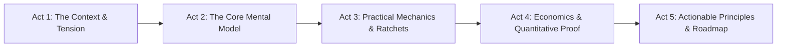

# The Blueprint Narrative Framework & Storyline Architecture

This document defines the storytelling strategy and chapter structure that makes **The AI Factory Blueprint** so persuasive and executive-ready.

---

### The 5-Act Narrative Arc

Every Blueprint deck follows a structured 5-Act narrative arc designed to transition technical audiences from ad-hoc operations to systematic manufacturing pipelines:

---

### Act 1: The Context & Tension (Where We Are vs. Where We Are Heading)
* **Objective**: Establish the pain point and create cognitive tension.
* **Archetype Used**: `chapter_divider` + `split_cards` (2-Card Comparison).
* **Key Narrative Moves**:
  * Contrast "Ad-hoc Chat & Hope" with "Deterministic Engineering".
  * Frame ambiguity not as a nuisance, but as a compounding cost across agent fleets.
  * Show why traditional prompting hits a hard ceiling when moving beyond toy scripts.

---

### Act 2: The Core Mental Model / Hierarchy (The Stepped Ladder)
* **Objective**: Give the audience a simple, memorable taxonomy.
* **Archetype Used**: `ladder_hierarchy` (4-step flow) + `executive_grid` (2x2 Quad).
* **The 4 Blueprint Disciplines**:
  1. **01 Prompt**: Guide intent with GCCD (Goal, Context, Constraints, Done-When).
  2. **02 Context**: Curate the window — compact, offload, and persist state in files.
  3. **03 Harness**: Equip tools, sandboxes, enforcing hooks, and adversarial ratchets.
  4. **04 Loop**: Automate the prompter — schedule loops with humans in the PR review seat.

---

### Act 3: Practical Mechanics & Concrete Code (The Enforcing Ratchet)
* **Objective**: Prove technical feasibility with concrete implementation artifacts.
* **Archetype Used**: `code_terminal` (Monospace container with Do/Don't status badges).
* **Key Narrative Moves**:
  * Show real configuration files (e.g. `.agent/hooks/pre-commit`, `loop.yaml`).
  * Contrast a green `✓ DO: RATCHETED` practice with a red `✗ DON'T: HOPE-BASED` anti-pattern.
  * Explain how pre-commit hooks and adversarial evaluator subagents make regressions impossible to repeat.

---

### Act 4: Economics & Quantitative Proof (The Cost of Skipping Basics)
* **Objective**: Justify the investment with hard benchmark and economics data.
* **Archetype Used**: `hero_metrics` (Side-by-side contrast cards).
* **Key Narrative Moves**:
  * Compare **Solo Model** ($9, 20 min, thrown away) vs. **Full Harness** ($200, 6 hours, production shippable).
  * Explain the trap: spending $200 of tokens and getting the $9 toy result because of weak prompts, bloated context, and zero evaluators.

---

### Act 5: Actionable Principles & Execution Roadmap
* **Objective**: Leave the audience with clear next steps.
* **Archetype Used**: `dodont_checklist` + `actionable_takeaways`.
* **Key Narrative Moves**:
  * Summarize deprecated practices vs. high-leverage skills (e.g. "Typing speed" is deprecated; "Problem decomposition" is high-leverage).
  * 3 Action Principles: Master Intent, Build Ratchets, Keep Humans in Review Seat.
  * 30-Day Execution Roadmap: Week 1 Hooks -> Week 2 Context -> Week 3 Maker-Checker -> Week 4 Loops.
