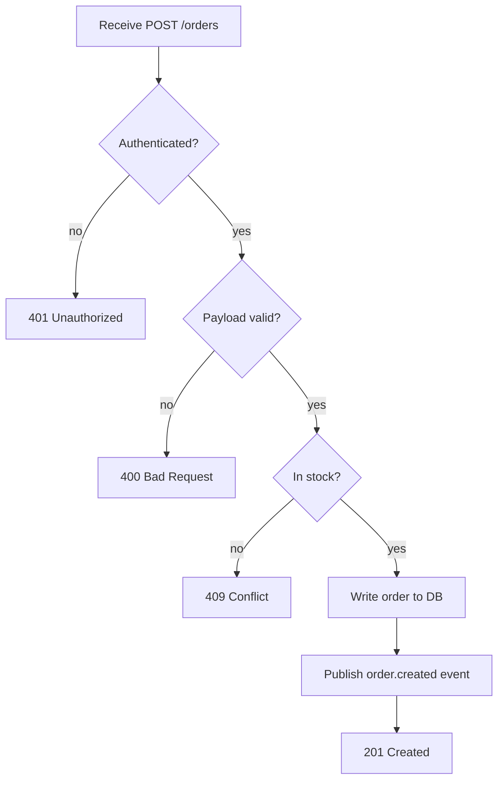

# Example: request lifecycle for `POST /orders`

**Reader:** a new engineer who needs to trace what happens to an order request.
**Goal:** after this, you can name every gate a request passes and where it can exit.

## Happy path + gates

> **What:** the control flow of `POST /orders`, from arrival to response.
> **Read:** top to bottom; diamonds are decisions, each branch is labelled.
> **Key:** validation (step 2) runs *before* any write — nothing touches the DB until
> the payload is valid and the caller is authorized.
> **Omitted:** retries, rate limiting, and async fulfilment (see other docs).



ASCII fallback:

```
 [POST /orders]
        |
  < Authenticated? > --no--> [401]
        | yes
  < Payload valid? > --no--> [400]
        | yes
  < In stock? > --------no--> [409]
        | yes
 [Write order to DB]
        |
 [Publish order.created]
        |
     [201 Created]
```

## Reading the flow

There are three exits before success — auth, validation, and stock — and they're
ordered cheapest-check-first. Only after all three pass does the request cause a
side effect (the DB write at the bottom), and the event is published *after* the write
commits so downstream consumers never see a phantom order.

For the *timing* of the same request across services, see
[02-auth-sequence.md](./02-auth-sequence.md).
