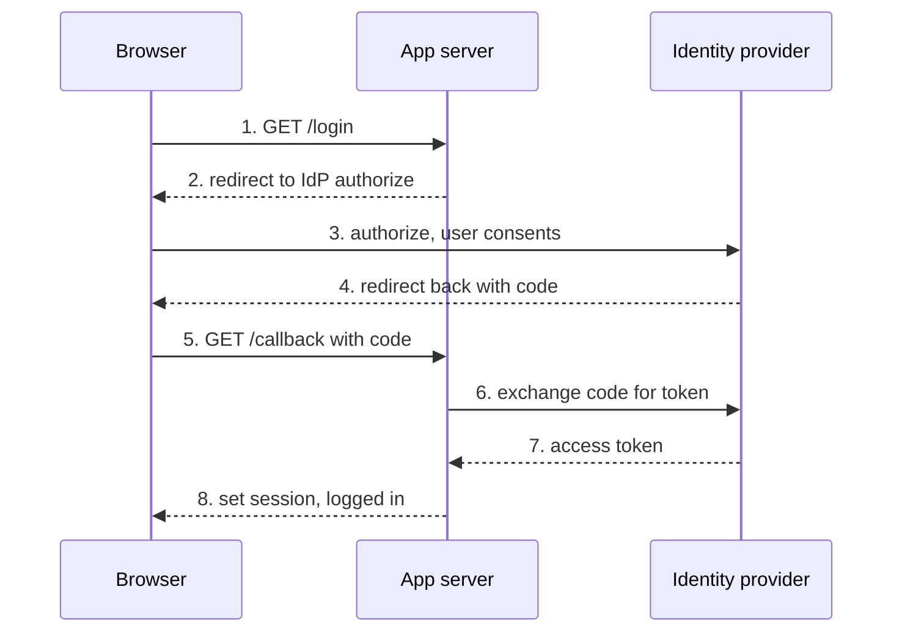

# Example: OAuth 2.0 authorization-code handshake

**Reader:** an integrator wiring "Sign in with Provider" for the first time.
**Goal:** after this, you can say which party holds which secret and why the code is
exchanged server-side, not in the browser.

## The handshake

> **What:** the authorization-code flow between the user's browser, your app's server,
> and the identity provider (IdP).
> **Read:** top to bottom; solid arrows are requests, dashed are responses; steps are
> numbered.
> **Key:** the short-lived **code** travels through the browser (steps 3-4), but the
> **token** is fetched server-to-server (steps 5-6) so it never touches the browser.
> **Omitted:** PKCE, refresh tokens, and error redirects.



ASCII fallback:

```
Browser            App server           Identity provider
  | 1.GET /login       |                     |
  |------------------->|                     |
  | 2.redirect to IdP  |                     |
  |<-------------------|                     |
  | 3.authorize + consent                    |
  |----------------------------------------->|
  | 4.redirect back with code                |
  |<-----------------------------------------|
  | 5.GET /callback?code                     |
  |------------------->|                     |
  |                    | 6.exchange code     |
  |                    |-------------------->|
  |                    | 7.access token      |
  |                    |<--------------------|
  | 8.session set, logged in                 |
  |<-------------------|                     |
```

## Why it's shaped this way

The browser is untrusted, so it only ever carries the **code** — a single-use,
short-lived credential useless without your app's client secret. The actual **token
exchange** (step 6) happens server-to-server, authenticated with that secret, so the
long-lived access token is never exposed to JavaScript or the URL bar. That split is
the whole security argument for authorization-code over implicit flow.
