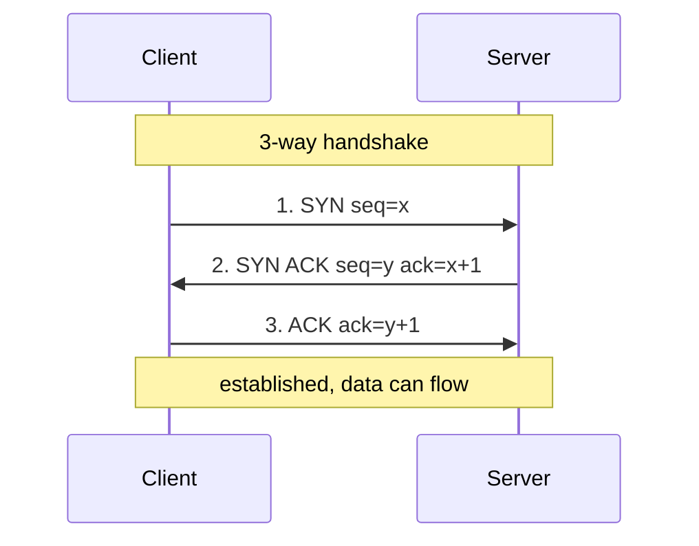

# Example: reading a TCP header and the 3-way handshake

**Reader:** someone debugging a connection who has never decoded a TCP header.
**Goal:** after this, you can find the flags byte in a hexdump and explain SYN/ACK.

## 1. The header layout

> **What:** the first 20 bytes of every TCP segment, drawn as a 32-bit-per-row grid.
> **Read:** left to right, top to bottom; each cell's width is its bit count.
> **Key:** the **Flags** field (row 4) carries SYN/ACK/FIN — it drives the handshake
> in §3.
> **Omitted:** options beyond byte 20, checksum, urgent pointer.

```
 0                   1                   2                   3
 0 1 2 3 4 5 6 7 8 9 0 1 2 3 4 5 6 7 8 9 0 1 2 3 4 5 6 7 8 9 0 1
+-+-+-+-+-+-+-+-+-+-+-+-+-+-+-+-+-+-+-+-+-+-+-+-+-+-+-+-+-+-+-+-+
|          Source Port          |       Destination Port        |
+-+-+-+-+-+-+-+-+-+-+-+-+-+-+-+-+-+-+-+-+-+-+-+-+-+-+-+-+-+-+-+-+
|                        Sequence Number                        |
+-+-+-+-+-+-+-+-+-+-+-+-+-+-+-+-+-+-+-+-+-+-+-+-+-+-+-+-+-+-+-+-+
|                    Acknowledgment Number                      |
+-+-+-+-+-+-+-+-+-+-+-+-+-+-+-+-+-+-+-+-+-+-+-+-+-+-+-+-+-+-+-+-+
| Offset| Rsvd  |     Flags     |             Window            |
+-+-+-+-+-+-+-+-+-+-+-+-+-+-+-+-+-+-+-+-+-+-+-+-+-+-+-+-+-+-+-+-+
```

## 2. Decode a real SYN

Grounding the layout in actual bytes is where it clicks:

```
Raw:  01 bb  d4 31  00 00 00 01  00 00 00 00  50 02 ff ff
      \___/  \___/  \_________/  \_________/  |  |  \___/
       443   54321      seq=1        ack=0    |  |  window=65535
                                             /    \
                            data offset=5 (20 bytes)
                                       flags=0x02 -> SYN
```

The `0x50` high nibble (`5`) means a 20-byte header; the next byte `0x02` has only
bit 1 set, which is **SYN** — so this is a connection opener with no payload.

## 3. The handshake over time

Bytes are static; the handshake is a conversation. Numbered, with state notes:



ASCII fallback:

```
Client                         Server
  |        1. SYN seq=x          |
  |----------------------------->|
  |    2. SYN,ACK seq=y ack=x+1  |
  |<-----------------------------|
  |     3. ACK ack=y+1           |
  |----------------------------->|
  |==== established =============|
```

## Putting it together

Every segment in §3 is a header shaped like §1. The SYN in step 1 is literally the
bytes you decoded in §2. The `ack=x+1` in step 2 is the server saying "I received your
seq=x, send me x+1 next" — sequence and acknowledgment numbers are how TCP turns those
static header fields into an ordered, reliable stream.
