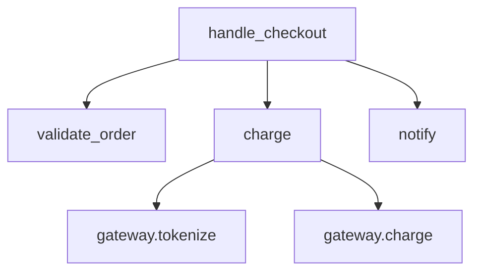
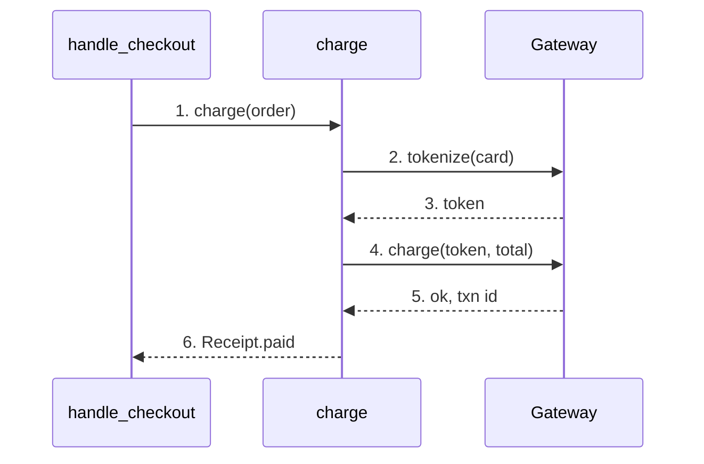

# Example: explaining the `charge()` function

**Reader:** a reviewer new to the payments module.
**Goal:** after this, you can state the one I/O call, the failure contract, and the
single success path.

## 1. Annotated source

> **What:** the whole `charge()` function with numbered callouts.
> **Read:** the code top to bottom; then the notes.
> **Key:** there is exactly one network call (3) and exactly one success return (5).
> **Omitted:** logging, metrics, idempotency keys.

```python
def charge(order, gateway):
    if order.total <= 0:                        # (1) guard
        return Receipt.free(order)
    token = gateway.tokenize(order.card)        # (2) tokenize first
    resp = gateway.charge(token, order.total)   # (3) the only I/O
    if not resp.ok:                             # (4) failure contract
        raise PaymentError(resp.code)
    return Receipt.paid(order, resp.id)         # (5) success
```

- **(1)** Zero-total orders exit before any network call.
- **(2)** Raw card data is exchanged for a token — card never leaves the gateway.
- **(3)** The only side-effecting call; everything after assumes it returned.
- **(4)** Failures become a typed `PaymentError`; callers branch on it.
- **(5)** The single success path — one return, easy to reason about.

## 2. Call graph (static)

> **What:** who `charge` calls and where it sits. Structure, not order.



ASCII fallback:

```
handle_checkout
├── validate_order
├── charge
│   ├── gateway.tokenize
│   └── gateway.charge
└── notify
```

## 3. Execution trace (one happy run)

> **What:** a single successful checkout across the collaborators. Numbered.
> **Key:** tokenize (4) precedes charge (6) — that ordering is the PCI boundary.



ASCII fallback:

```
handle_checkout    charge        Gateway
   | 1.charge        |             |
   |---------------->|             |
   |                 | 2.tokenize  |
   |                 |------------>|
   |                 | 3.token     |
   |                 |<------------|
   |                 | 4.charge    |
   |                 |------------>|
   |                 | 5.ok, id    |
   |                 |<------------|
   | 6.Receipt.paid  |             |
   |<----------------|             |
```

## The three views together

The **annotated block** tells you *what each line does*, the **call graph** tells you
*where `charge` sits*, and the **trace** tells you *what actually happens on a
purchase*. A reader who only sees the graph misses that tokenize must precede charge;
a reader who only sees the trace misses the zero-total guard. That's why code
explanation uses all three, not one.
