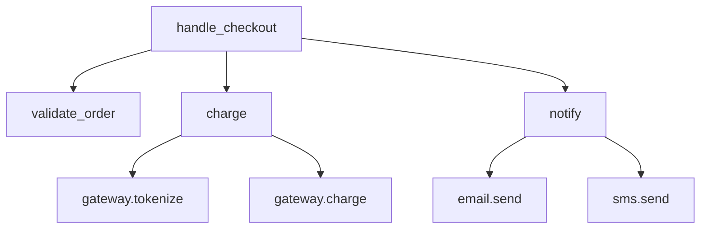
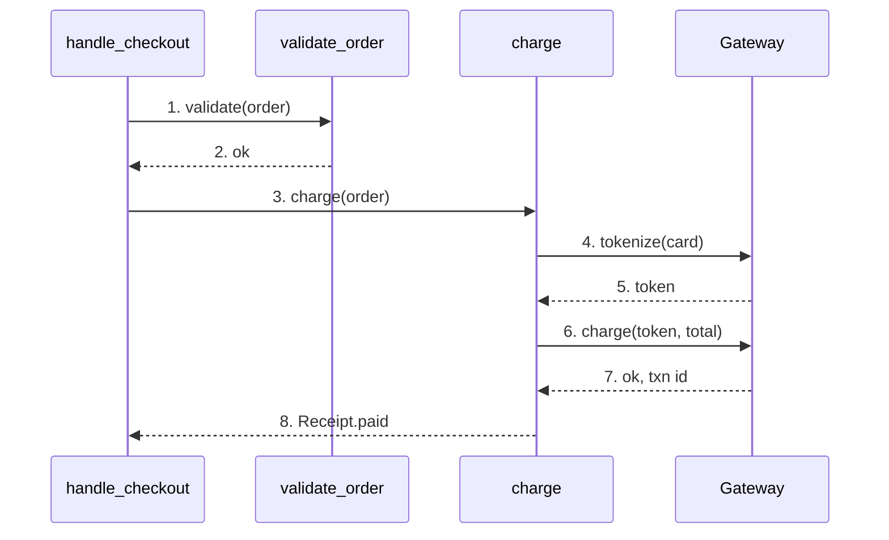
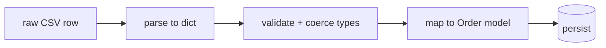
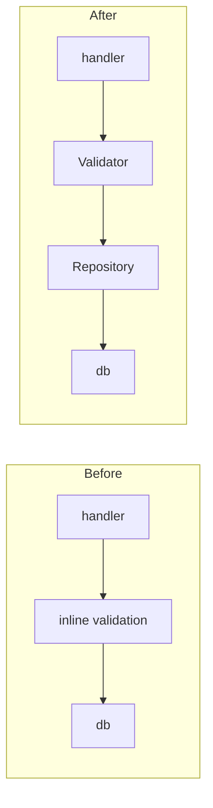

# Code explanation — annotate, graph, trace

To teach *code*, combine three complementary views: an **annotated block** (the code
itself, with callouts), a **call graph** (static structure — who calls whom), and an
**execution trace** (dynamic — one concrete run). Each answers a different question.

## 1. Annotated code block (callouts)

Show the real code, then attach numbered callouts. Keep the code verbatim; put the
teaching in the notes so the reader can still copy the source.

```python
def charge(order, gateway):
    if order.total <= 0:            # (1) guard: nothing to charge
        return Receipt.free(order)
    token = gateway.tokenize(order.card)   # (2) never store raw PAN
    resp = gateway.charge(token, order.total)  # (3) network call - can fail
    if not resp.ok:                 # (4) surface failure to caller
        raise PaymentError(resp.code)
    return Receipt.paid(order, resp.id)     # (5) success path
```

- **(1)** Fast-exit for zero-total orders — avoids a needless gateway round-trip.
- **(2)** Tokenization keeps card data out of our system (PCI scope).
- **(3)** The only I/O in the function; everything after assumes it returned.
- **(4)** Failures become a typed exception — callers branch on `PaymentError`.
- **(5)** The single success return; note there's exactly one.

Rules: number callouts in reading order; one idea per callout; point at the line that
carries the lesson (I/O, a guard, a subtle invariant), not every line.

## 2. Call graph (static structure)

Use a flowchart to show *who calls whom* — the shape of the module. This is the map;
it doesn't imply order of execution.



ASCII fallback:

```
handle_checkout
├── validate_order
├── charge
│   ├── gateway.tokenize
│   └── gateway.charge
└── notify
    ├── email.send
    └── sms.send
```

## 3. Execution trace (one concrete run)

A sequence diagram of *one path through* the code teaches order and failure handling
in a way the static graph can't. Number the steps; show the unhappy path separately.



ASCII fallback:

```
handle_checkout   validate   charge     Gateway
   | 1.validate      |          |          |
   |---------------->|          |          |
   | 2.ok            |          |          |
   |<----------------|          |          |
   | 3.charge        |          |          |
   |---------------------------->|         |
   |                 | 4.tokenize|         |
   |                 |------------------->|
   |                 | 5.token   |         |
   |                 |<-------------------|
   |                 | 6.charge  |         |
   |                 |------------------->|
   |                 | 7.ok,id   |         |
   |                 |<-------------------|
   | 8.Receipt.paid  |          |          |
   |<----------------------------|         |
```

## 4. Data-transformation pipeline

When code is a series of transforms (parse → validate → map → persist), show the data
shape at each stage — the lesson is the *shape change*, not the calls.



ASCII with shapes:

```
"a,b,c"  -->  {a,b,c}  -->  {a:int,b:date}  -->  Order(...)  -->  (DB)
 string       dict          typed dict          model          row
```

## 5. Before / after (refactors, reviews)

For a change, show the affected slice twice at the same altitude so the diff is
legible. Keep node names identical across both so only the change stands out.



## Choosing among these

| Question the reader has | View |
|---|---|
| "What does this code do, line by line?" | Annotated block (§1) |
| "What's the structure / who calls what?" | Call graph (§2) |
| "What actually happens on a request?" | Execution trace (§3) |
| "How does the data change?" | Pipeline (§4) |
| "What did this change do?" | Before/after (§5) |

Pair each with narration (see [`didactic-strategy.md`](./didactic-strategy.md)) and
validate every Mermaid block with `validate-diagrams.sh`.
