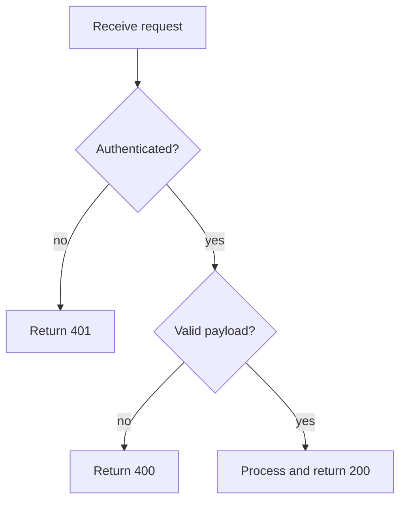
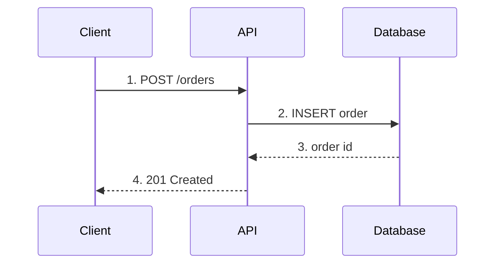
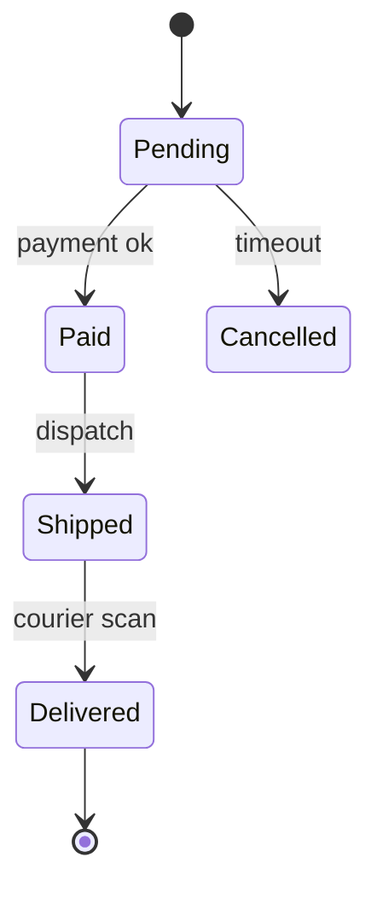
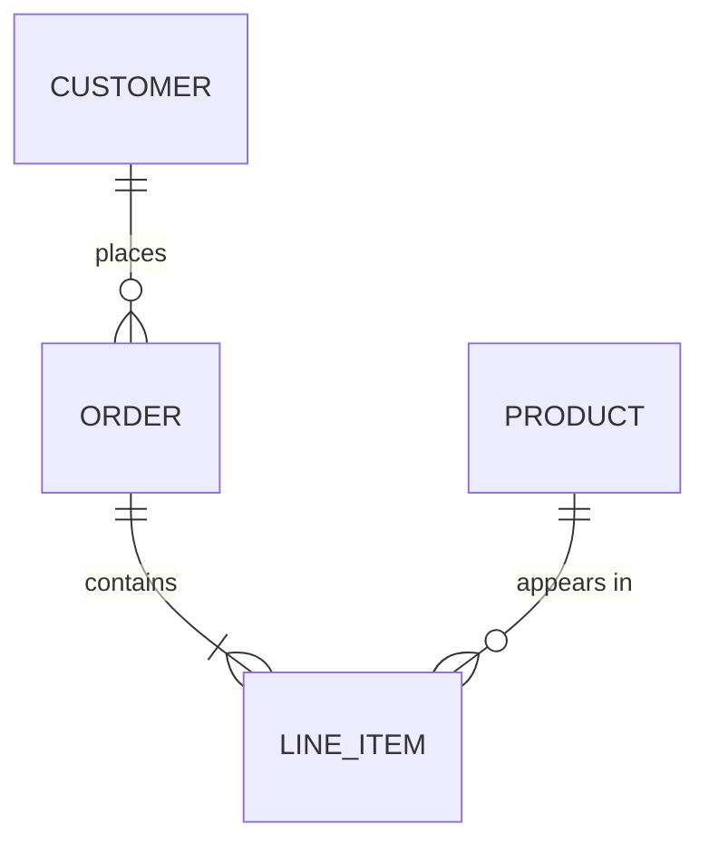
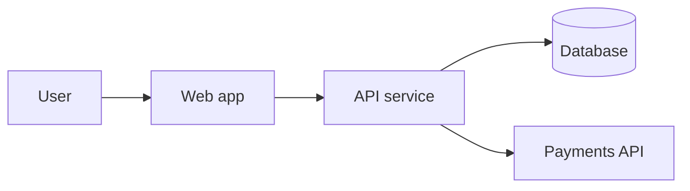
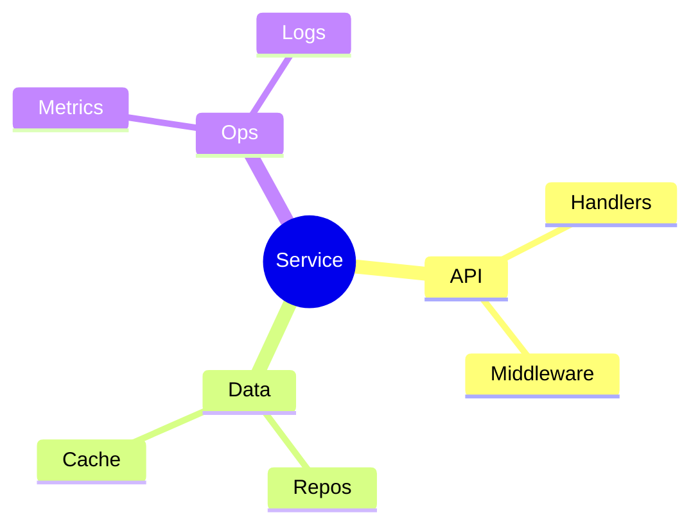

# Diagram-type guide — concept → form, with snippets

Match the concept you're teaching to the diagram form. Each entry has a validated
Mermaid snippet and an ASCII equivalent you can paste and adapt. All Mermaid here
compiles with `validate-diagrams.sh`.

---

## Control flow / decisions → flowchart

Use when the lesson is *logic and branching* — what happens, and which way execution
goes at each decision.



ASCII equivalent:

```
        +---------------------+
        |  Receive request    |
        +----------+----------+
                   |
             < Authenticated? >
              no /        \ yes
                v          v
          [401]        < Valid payload? >
                        no /       \ yes
                          v         v
                       [400]     [200 OK]
```

Tips: diamonds = decisions; **label every branch**; keep one entry and clearly marked
exits. `TD` (top-down) reads as "steps"; `LR` reads as "pipeline".

---

## Interaction over time → sequence diagram

Use when the lesson is *who talks to whom, in what order* — request/response,
handshakes, message passing. Number the messages.



ASCII equivalent:

```
Client            API             Database
  |  1.POST /orders |                |
  |---------------->|  2.INSERT      |
  |                 |--------------->|
  |                 |  3.order id    |
  |                 |<---------------|
  |  4.201 Created  |                |
  |<----------------|                |
```

Gotchas (GitHub): message text must be plain ASCII — no backticks, no `--`, no
`<br/>`, no unicode arrows; no `()` in `participant ... as` aliases. Use `-->>` for
responses (dashed), `->>` for calls (solid).

---

## Lifecycle / status → state diagram

Use when the lesson is *the states a thing moves through* and what triggers each move.



ASCII equivalent:

```
 [*] --> Pending --( payment ok )--> Paid --( dispatch )--> Shipped
             |                                                  |
        ( timeout )                                     ( courier scan )
             v                                                  v
         Cancelled                                          Delivered --> [*]
```

Put the **event** on the edge (`Pending --> Paid: payment ok`), not inside the node.

---

## Data shape & relationships → ER diagram

Use when the lesson is *the data model* — entities and how they relate.



ASCII equivalent:

```
CUSTOMER --< ORDER --< LINE_ITEM >-- PRODUCT
  (1)    (many) (1)  (many)   (many)  (1)

  --<  "one to many"        >--  "many to one"
```

Cardinality crib: `||` exactly one, `o{` zero-or-many, `|{` one-or-many.

---

## System / architecture → C4 (context zoom)

Use for architecture. Prefer a real C4 model for multi-view consistency
([`architecture-c4.md`](./architecture-c4.md)); for a single inline view a flowchart
with subgraphs works:



ASCII equivalent:

```
 [User] --> [Web app] --> [API service] --> ( Database )
                               |
                               v
                         [Payments API]
```

---

## Hierarchy / breakdown → mindmap

Use to break a topic into parts for onboarding overviews.



ASCII equivalent:

```
Service
├── API
│   ├── Handlers
│   └── Middleware
├── Data
│   ├── Repos
│   └── Cache
└── Ops
    ├── Metrics
    └── Logs
```

---

## Quick chooser

| Concept | Type |
|---|---|
| "then it decides…" | flowchart |
| "A calls B, then B calls C" | sequenceDiagram |
| "it can be X, then becomes Y" | stateDiagram-v2 |
| "these tables/entities relate" | erDiagram |
| "the bytes on the wire" | ASCII packet walk |
| "the boxes of the system" | C4 / flowchart subgraphs |
| "the parts of this topic" | mindmap / ASCII tree |
