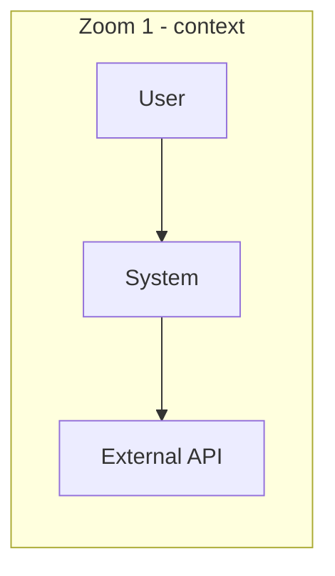
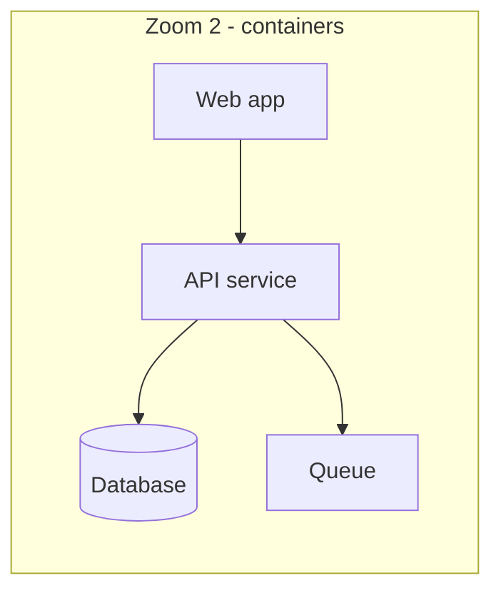
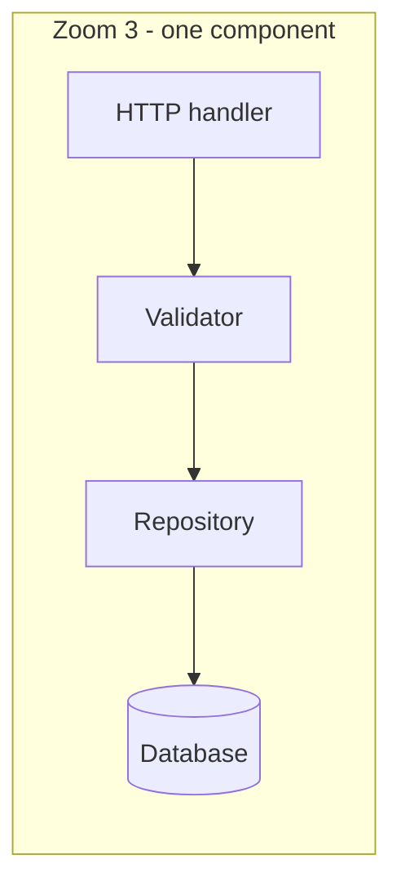

# Didactic strategy — how to explain visually

The diagram is the visual; the *lesson* is the pairing of diagram + narration +
sequencing. This file is the playbook for the teaching layer. (For which diagram
*type* to use, see [`diagram-type-guide.md`](./diagram-type-guide.md).)

## The core loop

For any explanation, answer these before drawing:

1. **Who is the reader?** New hire, reviewer, on-caller, external integrator. This
   sets the altitude and how much you can assume.
2. **What is the ONE thing they should be able to do/say afterward?** ("Trace a
   request end to end", "know which service owns retries", "read a TCP header").
3. **What's the smallest picture that starts them there?** Draw that first.

Everything else is elaboration of that one thing.

## Principle 1 — Progressive disclosure (zoom, don't dump)

Show the big picture, then progressively add detail. Each diagram should be
understandable on its own, and set up the next.

A three-zoom progression for a system:







**Anti-pattern:** opening with the 40-node everything-diagram. If a reader has to
hunt for where to start, the diagram failed. Split by zoom level instead.

## Principle 2 — One concept per diagram

If you catch yourself writing "ignore the left half for now", that's two diagrams.
Symptoms you've overloaded a diagram: needing two paragraphs to excuse it; crossing
edges you apologize for; a legend longer than the diagram.

## Principle 3 — Always narrate

The diagram shows *structure*; the prose carries the *lesson*. Pair every diagram
with narration that answers:

- **What am I looking at?** (one sentence naming the view)
- **Where do I start / what's the path?** (the reading order)
- **What's the important part?** (the thing the reader should remember)
- **What's deliberately omitted?** (so they don't think it's the whole truth)

Narration template:

> **What:** the request lifecycle for `POST /orders`.
> **Read:** top to bottom; the dashed arrow is the async path.
> **Key:** validation happens *before* any write — step 2 gates everything after.
> **Omitted:** retries and auth (covered separately).

## Principle 4 — Give a legend/key

Define your vocabulary once so shapes and lines mean something consistent:

```
Legend
  [ Box ]      a service / component
  ( Store )    a datastore
  --->         synchronous call
  - - ->       asynchronous / event
  #            decision point
```

Keep the same conventions across every diagram in a document. Reusing shape/arrow
meaning is itself teaching — the reader learns your notation once.

## Principle 5 — Number the steps

Ordered flows and walks get explicit numbers so the reader can follow along and you
can reference them in prose ("at step 3 the token is verified"). In sequence diagrams,
prefix messages with `1.`, `2.`, …; in ASCII walks, number the stages.

## Principle 6 — Calibrate altitude to the audience

| Reader | Wants | Altitude |
|---|---|---|
| New hire / onboarding | The mental model, names of things | Context + one flow, few details |
| Reviewer of a change | What changed and its blast radius | Before/after of the affected slice |
| On-caller / debugger | Failure paths, timeouts, retries | The unhappy paths, explicitly |
| External integrator | The contract, not the internals | Sequence at the API boundary only |

State the intended reader near the top of the doc. When in doubt, write two views at
two altitudes rather than one compromise view.

## "Explain-this" recipes

Fast mappings from a request to a plan:

- **"Explain how a request flows"** → context zoom + a numbered `sequenceDiagram` at
  the boundary + narration of the happy path, then a second diagram for the failure
  path. See [`examples/01-request-flow.md`](../examples/01-request-flow.md) and
  [`examples/02-auth-sequence.md`](../examples/02-auth-sequence.md).
- **"Explain this protocol / packet"** → ASCII header layout with an offset ruler +
  a numbered wire walk + a handshake `sequenceDiagram`. See
  [`packet-walks.md`](./packet-walks.md) and
  [`examples/03-tcp-packet-walk.md`](../examples/03-tcp-packet-walk.md).
- **"Explain this function/module"** → annotated code block (callout comments) + a
  call graph + one execution-trace walk. See [`code-explanation.md`](./code-explanation.md)
  and [`examples/04-code-explainer.md`](../examples/04-code-explainer.md).
- **"Explain this architecture"** → C4 progression (context → container → component),
  driven from one model so views stay consistent. See
  [`architecture-c4.md`](./architecture-c4.md).
- **"Explain this lifecycle/state"** → `stateDiagram-v2` with events on the edges +
  narration of the terminal states.

## Quality checklist (before you commit)

- [ ] Intended reader stated.
- [ ] Each diagram teaches one thing; the big picture comes first.
- [ ] Every diagram has narration (what / read-order / key / omitted).
- [ ] A legend defines shapes, arrows, actors.
- [ ] Ordered flows are numbered.
- [ ] Complex Mermaid has an ASCII fallback; packets/bytes are ASCII.
- [ ] All Mermaid compiles (`validate-diagrams.sh`).
