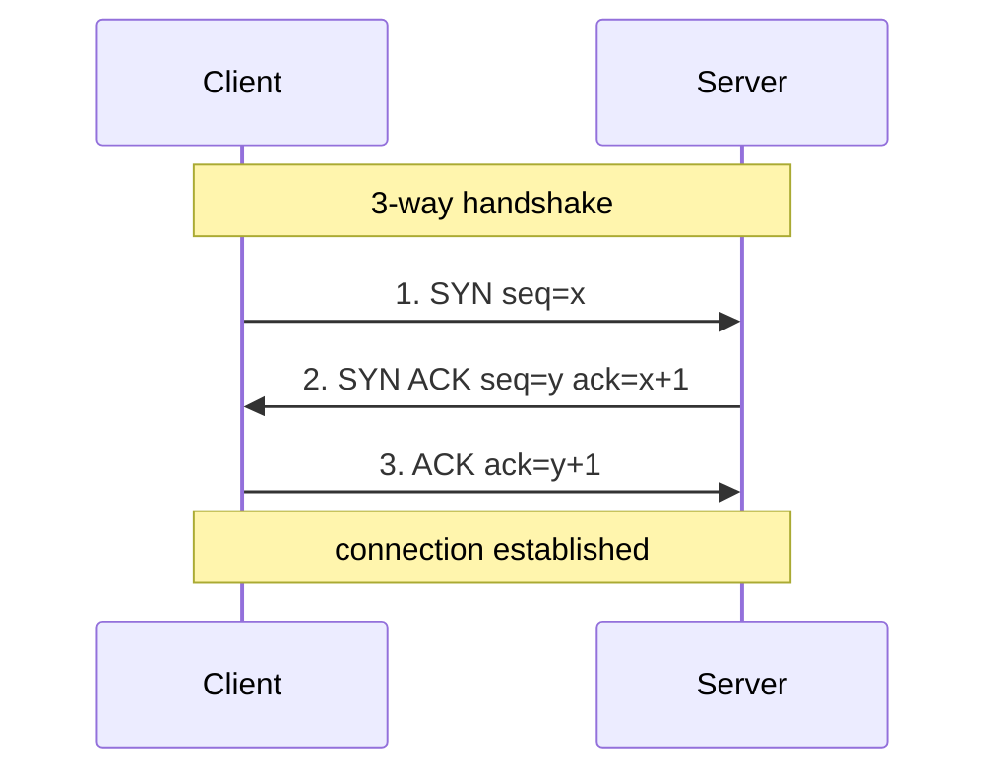

# Packet & byte walks — teach wire formats with ASCII

For wire formats, protocol headers, byte/bit layouts, and memory maps, **ASCII beats
Mermaid**: it shows exact field widths and offsets, renders in any terminal, and diffs
cleanly. Reserve Mermaid `sequenceDiagram` for the *handshake* (the messages over
time); use ASCII for the *bytes*.

## 1. RFC-style header box (with a bit ruler)

The convention (from IETF RFCs): a 32-bit-wide grid, MSB first, with a ruler across
the top. Each field's width equals its bit count.

```
 0                   1                   2                   3
 0 1 2 3 4 5 6 7 8 9 0 1 2 3 4 5 6 7 8 9 0 1 2 3 4 5 6 7 8 9 0 1
+-+-+-+-+-+-+-+-+-+-+-+-+-+-+-+-+-+-+-+-+-+-+-+-+-+-+-+-+-+-+-+-+
|          Source Port          |       Destination Port        |
+-+-+-+-+-+-+-+-+-+-+-+-+-+-+-+-+-+-+-+-+-+-+-+-+-+-+-+-+-+-+-+-+
|                        Sequence Number                        |
+-+-+-+-+-+-+-+-+-+-+-+-+-+-+-+-+-+-+-+-+-+-+-+-+-+-+-+-+-+-+-+-+
|                    Acknowledgment Number                      |
+-+-+-+-+-+-+-+-+-+-+-+-+-+-+-+-+-+-+-+-+-+-+-+-+-+-+-+-+-+-+-+-+
| Offset| Rsvd  |     Flags     |             Window            |
+-+-+-+-+-+-+-+-+-+-+-+-+-+-+-+-+-+-+-+-+-+-+-+-+-+-+-+-+-+-+-+-+
```

**Narrate it:** name the reader ("you'll be able to read a TCP header hexdump"), then
walk fields in reading order, calling out the one that matters for the lesson (e.g.
"the Flags byte is where SYN/ACK live — that's what drives the handshake below").

## 2. Byte-offset table (for parsing)

When the lesson is *how to parse*, an offset table teaches better than a box:

```
Offset  Size  Field              Notes
------  ----  -----------------  ---------------------------------
0x00    2     Source Port        big-endian uint16
0x02    2     Dest Port          big-endian uint16
0x04    4     Sequence Number    wraps at 2^32
0x08    4     Ack Number         valid only if ACK flag set
0x0C    1     Data Offset+Rsvd   high nibble = header words (x4 = bytes)
0x0D    1     Flags              bit0=FIN bit1=SYN bit2=RST ...
0x0E    2     Window             receiver's advertised buffer
```

## 3. A concrete example with real bytes

Ground the abstraction in one decoded sample — this is where it clicks:

```
Raw:  01 bb  d4 31  00 00 00 01  00 00 00 00  50 02 ff ff ...
      \___/  \___/  \_________/  \_________/  |  |  \___/
        |      |         |            |       |  |    |
   src=443  dst=54321  seq=1        ack=0     |  |  window=65535
                                             /    \
                              data offset=5 (20 bytes)
                                          flags=0x02 -> SYN
```

## 4. The handshake over time → sequence diagram

Bytes are static; the *handshake* is temporal — that's the one place Mermaid earns its
keep. Number the steps and annotate the flags/state.



ASCII fallback for the handshake:

```
Client                         Server
  |        1. SYN (seq=x)         |
  |----------------------------->|
  |    2. SYN,ACK (seq=y,        |
  |        ack=x+1)              |
  |<-----------------------------|
  |     3. ACK (ack=y+1)         |
  |----------------------------->|
  |==== connection established ==|
```

## Authoring rules for ASCII diagrams

- Put them in a fenced code block (no language, or ` ```text `) so monospacing and
  spacing are preserved — otherwise Markdown collapses the alignment.
- Use a **fixed grid**: pick 32 bits/row for network headers; keep `+` at every field
  boundary so widths read as bit counts.
- Keep field names short enough to fit their cell; if not, use the offset table (§2).
- Number multi-step walks; call out the byte that carries the lesson.
- ASCII needs no compiler — but keep line lengths sane (≤ 72 for RFC-style) so it
  doesn't wrap in narrow views.

## When to use which

| Teaching goal | Form |
|---|---|
| Field layout / widths | RFC-style header box (§1) |
| How to parse programmatically | Offset table (§2) |
| Make it concrete | Decoded real-bytes sample (§3) |
| The exchange over time | `sequenceDiagram` + ASCII fallback (§4) |
